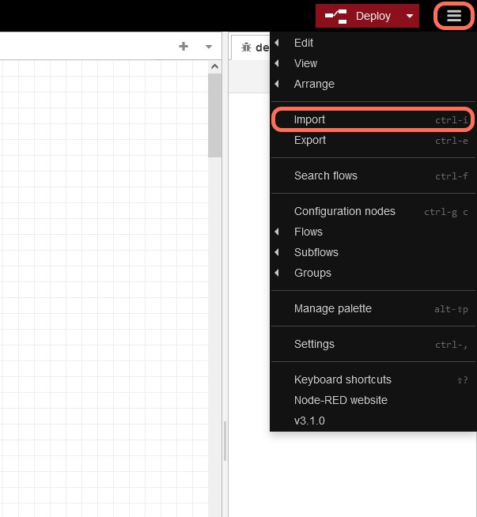
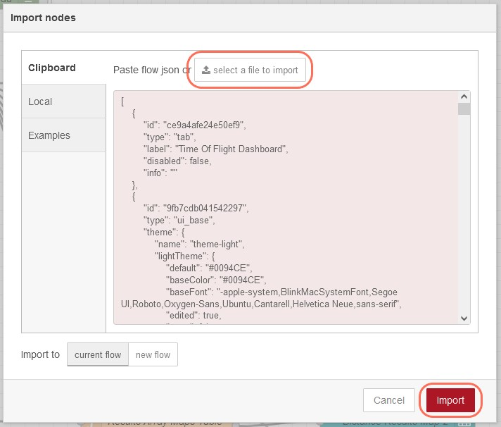
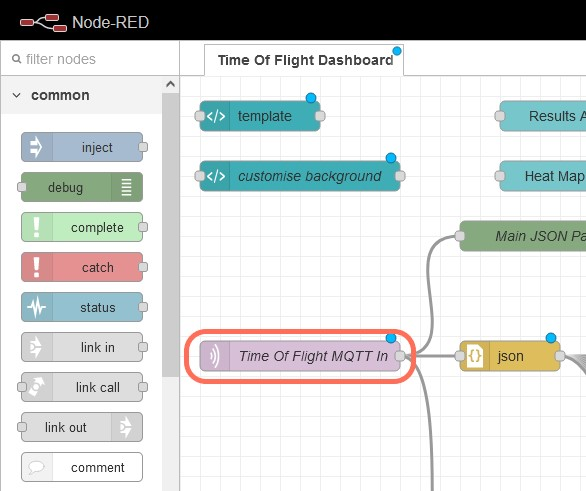
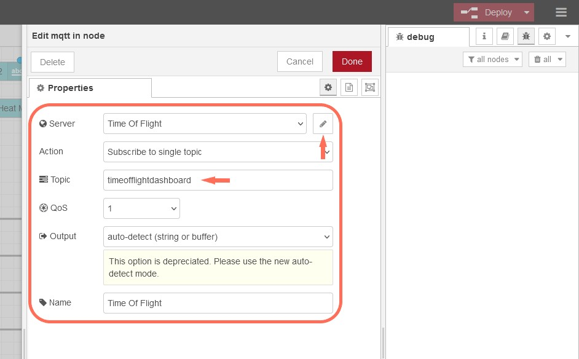
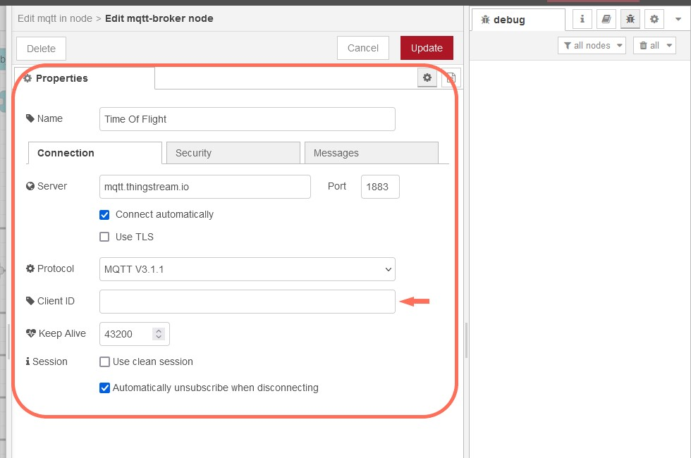
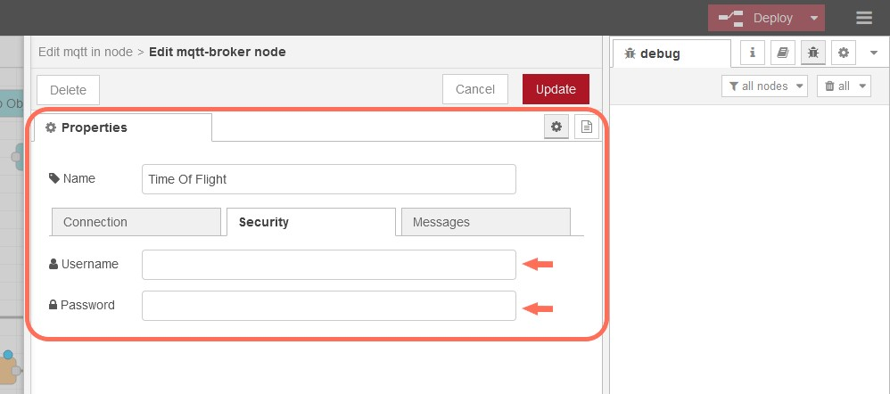
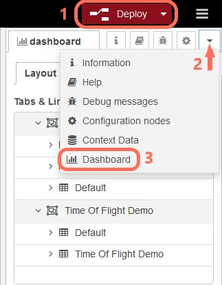
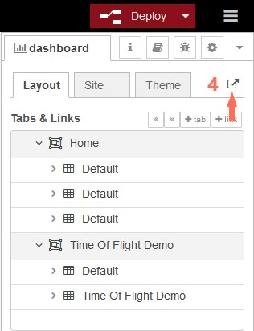

# LightRanger 9 Node-RED Dashboard

### Prerequisites

Before reading this section, be sure you have completed all the steps in [this guide](../thingstream_flow/Readme.md) and have already setup and deployed a flow in your Thingstream domain.

## Description

Once you have properly setup your [sensor broadcaster](../sensor_broadcaster/) and XPLR-IOT-1 [Gateway](../Gateway/), you should be getting MQTT messages containing a JSON representation of the measurements in your Thingstream account, at the IP Thing assigned to your Gateway.

In order to be able to send those data to a Node-RED dashboard for visualization a flow is created, which publishes those data to another topic for the dashboard. Then another IP Thing should be created. The Node-RED dashboard can be connected to this new IP Thing and subscribe to the **dashboard topic** (the dashboard topic is setup during the creation of Thingstream flow). 

The Node-RED flow for the dashboard is provided in the TMF_Dashboard.json file.

Below are the instructions and steps on how to use it.
Before that make sure that you have completed all tasks mentioned in the Prerequisites section.

#### 1.Create a new IP Thing

Go to your Thingstream domain and create a new IP Thing (you could name it XPLR-IOT1 TOF Dashboard or something like this).

#### 2. Install Node-RED and Dashboard

Follow the [instructions in this link](https://developer.thingstream.io/guides/iot-communication-as-a-service/hardware/xplr-iot-1-quick-start-guide/node-red-dashboard) to install Node-RED and dashboard (world maps are not needed for this example).

After installing dashboard we need to install 2 more components.

Install [`node-red-node-ui-table`](https://flows.nodered.org/node/node-red-node-ui-table) by running the following command in your Power Shell cmd:\
```
npm install node-red-node-ui-table
```

Install [`node-red-contrib-ui-heatmap`](https://flows.nodered.org/node/node-red-contrib-ui-heatmap/in/590bc13ff3a5f005c7d2189bbb563976) by running the following command in your Power Shell cmd:\
```
npm install node-red-contrib-ui-heatmap
```

If you installed the required components while Node-Red is already running then you will need to stop the running instance from the command line and restart you server.

#### 3. Run Node-RED and import the TMF_Dashboard.json file

Once properly installed you should be able to run the following command in a command-line

```
node-red
```
After initialization of Node-RED completes, open a browser and type the following:
```
http://localhost:1880/
```
In the page that opens import the `TMF_Dashboard.json` file you find in this folder

<div align="center"></div>

<div align="center"></div>

#### 4. Configure Dashboard Flow

- In the flow that opens after import, double click the `Time Of Flight MQTT In` node.

<div align="center"></div>

- In the dialogue enter the MQTT topic name you assigned as **dashboard topic** in the Thingstream Flow (the topic name you assigned in the last node)
- Then press the button to setup the server

<div align="center"></div>

- In the server configuration, please fill in the `Client ID` field with the same value as the one from `Thingstream` (including the `device:` prefix)

<div align="center"></div>

- In the server configuration, please use the credentials from the IP thing you created in step 1 (NOT the credentials from the IP thing assigned to your Gateway).\
Hit the update button for the changes to take effect.

<div align="center"></div>


#### 4. View the Dashboard

If not already deployed, deploy the Flow with the Deploy button (upper right corner).
Select the down arrow on the far right of the Node-RED window and select "dashboard" and then on the top right of the pane is an arrow out - click that and a new browser tab is opened with the dashboard in it.

<div align="center"></div>
<div align="center"></div>


## Disclaimer
Copyright &copy; u-blox 

u-blox reserves all rights in this deliverable (documentation, software, etc.,
hereafter “Deliverable”). 

u-blox grants you the right to use, copy, modify and distribute the
Deliverable provided hereunder for any purpose without fee.

THIS DELIVERABLE IS BEING PROVIDED "AS IS", WITHOUT ANY EXPRESS OR IMPLIED
WARRANTY. IN PARTICULAR, NEITHER THE AUTHOR NOR U-BLOX MAKES ANY
REPRESENTATION OR WARRANTY OF ANY KIND CONCERNING THE MERCHANTABILITY OF THIS
DELIVERABLE OR ITS FITNESS FOR ANY PARTICULAR PURPOSE.

In case you provide us a feedback or make a contribution in the form of a
further development of the Deliverable (“Contribution”), u-blox will have the
same rights as granted to you, namely to use, copy, modify and distribute the
Contribution provided to us for any purpose without fee.