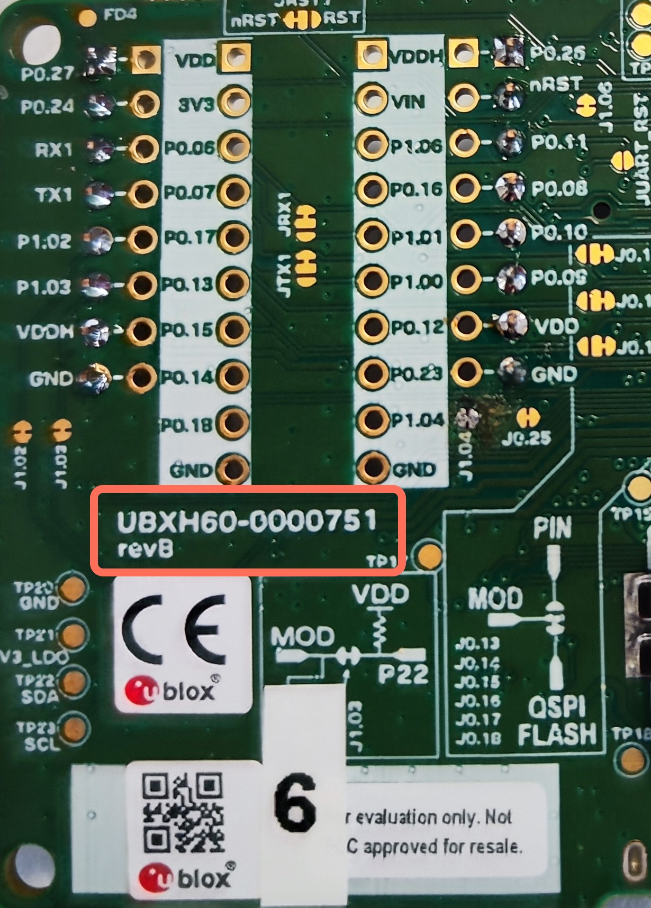
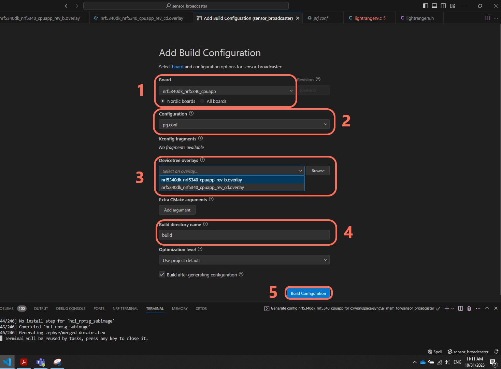

# Sensor Bluetooth LE Broadcaster

## Description

This application implements a basic wireless sensor.\
The application reads the sensor and uses NORA-B1 Bluetooth to broadcast the sensor measurements.\
It does that by spending the measurement data to Bluetooth LE Manufacturer-specific Advertising Data. 

So the device broadcasts the measurements, and any Bluetooth device that performs a scan operation within range, can get these data without the need for pairing.

This is the starting point, to read and broadcast the measurements, so that a Gateway can receive those measurements and send them to the MQTT Broker.

## Hardware Setup

You will need a [MINI-NORA-B1 Evaluation kit](https://www.u-blox.com/en/product/mini-nora-b1) and connect the [MikroE HVAC Click board MIKROE-4290](https://www.mikroe.com/hvac-click) to mikroBUS slot 1.

## Building

The example is built using **nRF Connect SDK version 1.9.1** and is advised to use this version to build the Sensor Bluetooth LE Broadcaster.\

You can build the application as any other Zephyr project (you can get some help [here](https://github.com/u-blox/XPLR-IOT-1-software#building--the-firmware)). 

This application is set up to compile and create an image that needs a J-Link to be programmed in MINI-NORA-B1.\
The option to compile it as an updatable image for use with a bootloader is not implemented.

### Selecting board overlays
There are 2 (possible 3 revisions of the board in the future):
- Rev B
- Rev C (and possible D)

The revision identifier can be found at the back of the board just below mikroBUS port one:

According to the revision the right device overlay must be chosen when creating the build configuration for the project.

To prepare the build configuration:
1. Click the NRF tools icon on the right toolbar.
2. Make sure the correct SDK is selected `1.9.1`
3. Click `Create new build configuration`

On the `Add Build Configuration` menu:
1. Select the appropriate board type `nrf5340dk_nrf5340_cpuapp`
2. From the drop down menu select project `Configuration`
3. In the `Devicetree overlay` select you overlay depending on the revision of the board
4. Select a name for your build directory

## Flashing

You can flash the project as any other Zephyr project (using VS Code is recommended). A J-Link is required to Flash the application.
You can get some help on Flashing [here](https://github.com/u-blox/XPLR-IOT-1-software#programming-the-firmware-using-a-j-link-debugger).

This application uses both the APPLICATION and NETWORK cores of nRF5340 in NORA-B1.

If you want to flash the project, after building: 
- You can use VS Code to Flash the device (recommended)
- You can use `build/zephyr/merged_domains.hex` file to program the app with nRF Connect -> Programmer application.
- You can use nrftools to program the device with command line. You can use `build/zephyr/zephyr.hex` and `build\hci_rpmsg\zephyr\zephyr.hex` files for this.

## Configuration

The sensor driver should work properly as is.\
There are not many options offered for the project.\
You could change the name of the device for advertising but is highly not recommended since then you would need to also change payload sizes for BLE communication.

## Expected Console Output

When running the application, at the UART console output you should see something like this

## Disclaimer LightRanger9 (TMF8828) driver
The driver used in this application is taken from [MikroE libstock](https://libstock.mikroe.com/projects/view/5000/lightranger-9-click) repo and modified to be compatible with Zephyr drivers structure.

Copyright (C) 2020 MikroElektronika d.o.o.\
Contact: https://www.mikroe.com/contact

Permission is hereby granted, free of charge, to any person obtaining a copy\
of this software and associated documentation files (the "Software"), to deal\
in the Software without restriction, including without limitation the rights\
to use, copy, modify, merge, publish, distribute, sublicense, and/or sell\
copies of the Software, and to permit persons to whom the Software is\
furnished to do so, subject to the following conditions:\
The above copyright notice and this permission notice shall be\
included in all copies or substantial portions of the Software.

THE SOFTWARE IS PROVIDED "AS IS", WITHOUT WARRANTY OF ANY KIND,\
EXPRESS OR IMPLIED, INCLUDING BUT NOT LIMITED TO THE WARRANTIES\
OF MERCHANTABILITY, FITNESS FOR A PARTICULAR PURPOSE AND NONINFRINGEMENT.\
IN NO EVENT SHALL THE AUTHORS OR COPYRIGHT HOLDERS BE LIABLE FOR ANY CLAIM,\
DAMAGES OR OTHER LIABILITY, WHETHER IN AN ACTION OF CONTRACT, TORT\
OR OTHERWISE, ARISING FROM, OUT OF OR IN CONNECTION WITH THE SOFTWARE OR THE\
USE OR OTHER DEALINGS IN THE SOFTWARE.

## Disclaimer
Copyright &copy; u-blox 

u-blox reserves all rights in this deliverable (documentation, software, etc.,
hereafter “Deliverable”). 

u-blox grants you the right to use, copy, modify and distribute the
Deliverable provided hereunder for any purpose without fee.

THIS DELIVERABLE IS BEING PROVIDED "AS IS", WITHOUT ANY EXPRESS OR IMPLIED\
WARRANTY. IN PARTICULAR, NEITHER THE AUTHOR NOR U-BLOX MAKES ANY\
REPRESENTATION OR WARRANTY OF ANY KIND CONCERNING THE MERCHANTABILITY OF THIS\
DELIVERABLE OR ITS FITNESS FOR ANY PARTICULAR PURPOSE.

In case you provide us a feedback or make a contribution in the form of a\
further development of the Deliverable (“Contribution”), u-blox will have the\
same rights as granted to you, namely to use, copy, modify and distribute the\
Contribution provided to us for any purpose without fee.