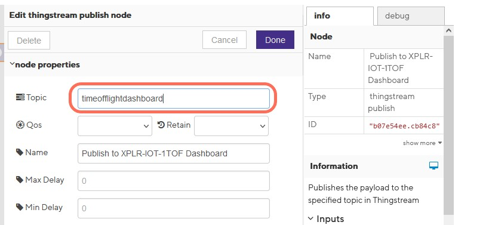
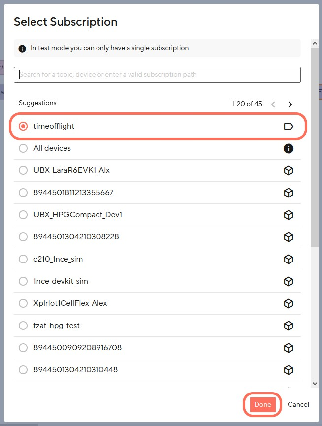
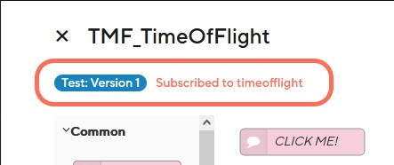

# Time Of Flight Monitor - Thingstream Flow for Dashboard.

## Description

Once you have properly setup your [sensor broadcaster](../sensor_broadcaster/) and XPLR-IOT-1 [Gateway](../Gateway/), you should be getting MQTT messages containing a JSON representation of the measurements in your Thingstream account, at the IP Thing assigned to your Gateway.

These measurements are published in the topic defined by the following definition in [Gateway main.c file](../Gateway/src/main.c)
```
// Topic name where the received measurements are going to be published
// Should be defined to Thingstream as well
#define MQTT_TOPIC "timeofflight"
```

In order to be able to send those data to a Node-RED dashboard for visualization a flow should be created in Thingstream to publish those measurement data to the dashboard.

The steps to follow are given below

#### 1. Create topic in Thingstream

Create a topic in Thingstream with the same name as the `MQTT_TOPIC` definition in Gateway code (default: timeofflight)


#### 2. Create a flow

Create a flow: Go to Thingstream -> Flows -> Create Flow -> New Flow


Give a name to your Flow and then add nodes as shown in the picture below:


Double click the last node (*Publish to XPLR-IOT-1 TOF Dashboard* in the picture) and assign a **dashboard topic** to it



Deploy your flow to the `MQTT_TOPIC` from step 1.
In order to do that:
- Press the deploy button in the upper right corner in your flow view
- Press the edit subscription button


- Choose the `MQTT_TOPIC` created in step 1. 



- Hit the deploy button
- Check that your flow is subscribed to the correct topic.




## Disclaimer
Copyright &copy; u-blox 

u-blox reserves all rights in this deliverable (documentation, software, etc.,\
hereafter “Deliverable”). 

u-blox grants you the right to use, copy, modify and distribute the\
Deliverable provided hereunder for any purpose without fee.

THIS DELIVERABLE IS BEING PROVIDED "AS IS", WITHOUT ANY EXPRESS OR IMPLIED\
WARRANTY. IN PARTICULAR, NEITHER THE AUTHOR NOR U-BLOX MAKES ANY\
REPRESENTATION OR WARRANTY OF ANY KIND CONCERNING THE MERCHANTABILITY OF THIS\
DELIVERABLE OR ITS FITNESS FOR ANY PARTICULAR PURPOSE.

In case you provide us a feedback or make a contribution in the form of a\
further development of the Deliverable (“Contribution”), u-blox will have the\
same rights as granted to you, namely to use, copy, modify and distribute the\
Contribution provided to us for any purpose without fee.